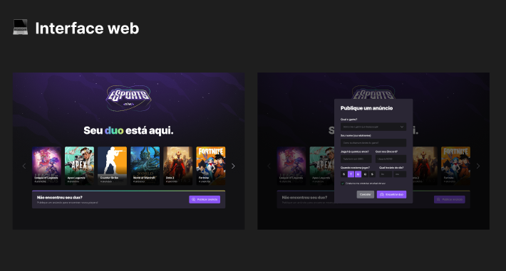
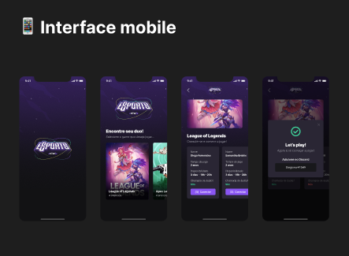

<h1>(nlw - Duo eSports)</h1>

<strong>
  Projeto desenvolvido durante a semana Ignite, que basicamente é um evento que tem como finalidade desenvolver uma aplicação totalmente Full-Stack, aplicando conhecimentos de Front-end, Back-end e Mobile.
</strong>

<h2>Sobre o Projeto</h2>

<strong>
  Encontrar o seu Dou "Parceiro(a)", para jogar Games que estão em alta no momento. Na Interface da aplicação terá uma lista representando cada jogo, e a quantidade de "anúncios" que representa a quantidade de jogadores que estão disponíveis para forma um duo.
  
  ####

  Na interface do Mobile o usuário pode clicar no card do game, e logo depois aparece-rá a lista dos anúncios em que cada elemento contém detalhes de cada jogador disponível, como por exemplo: o nickname do discord (em que usuário pode se conectar via discord), anos em que o jogador frequenta o game, dia(s) em que o jogador fica frequentemente disponível para jogar, hora(s) e se tem disponibilidade para conversar com o microfone aberto. 
</strong>

  
Interfaces 💻📱

   
  

    
Web 💻

    
  

  

    
Mobile 📱

    
  

<h2>Stakes Utilizadas no Projeto</h2>

  

    
Stakes Web

     - React
     - TailwindCSS
     - TypeScript
     - Axios
     - Phosphor-React
  

  

    
Stakes Mobile

    - React-Native
    - TypeScript
    - Expo
    - Phosphor-React-Native
  

  

    
Stakes Server

    - NodeJS
    - TypeScript
    - Express
    - Prisma
    - Cors
    - sqlite
    - ts-node-dev
  

  <h2>Instalação do Projeto</h2>

  1. Clone o repositório

  - Use o comando: `git clone git@github.com:PedroPDIN/project-duo-eSport.git`
  - Atenção em cada diretório(web, mobile e server) execute o passo a passo abaixo:

  

  
2. Web (Front-end)

  * Entre do repositório web, com o comando: `cd web` (lembrando que você precisa esta no terminal do diretório web).

  * Logo após Instale as dependências com o comando: `npm install`. 
  
  

  

  
3. Mobile

  * Entre do repositório mobile com o comando: `cd mobile`(lembrando que você precisa esta no terminal do diretório mobile).

  * Logo após Instale as dependências com o comando: `npm install` 

  

  

  
4. Server (Back-end)

  * Entre do repositório server com o comando: `cd server` (lembrando que você precisa esta no terminal do diretório server).

  * Logo após Instale as dependências com o comando: `npm install`

  * É preciso que haja a conexão com banco para que o server (back-end), funcione corretamente com isso é  necessário criar e adicionar informações ao arquivo `.env`. Existe mas detalhes para implementar os dados no arquivo `.env.example`.

  * Logo depois basta executar o comando `npx prisma generate`. Isso restabelecerá o link entre o arquivo schema.prisma e `.env`.

### Status do PRojeto
#### :rocket: Completo :rocket:
#### (Em breve mais melhorias para aplicação e para estrutura do código)

