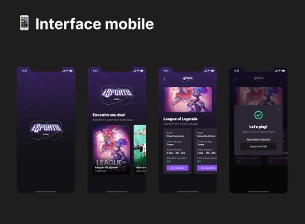

<h1>(nlw - Duo eSports)</h1>
<h2>Mobile</h2>

  
Interface 

   
  

    
Mobile 

    
  

<h2>Stakes Utilizadas na diretório Mobile</h2>

  

    
Stakes Mobile

    - React-Native
    - TypeScript
    - Expo
    - Phosphor-React-Native
  

  <h2>Instalação do Projeto</h2>

  1. Clone o repositório

  - Use o comando: `git clone git@github.com:PedroPDIN/project-duo-eSport.git`
  - Atenção em cada diretório(web, mobile e server) execute o passo a passo abaixo:

  

  
Mobile

  * Entre do repositório mobile com o comando: `cd mobile`(lembrando que você precisa esta no terminal do diretório mobile).

  * Logo após Instale as dependências com o comando: `npm install` 

  

